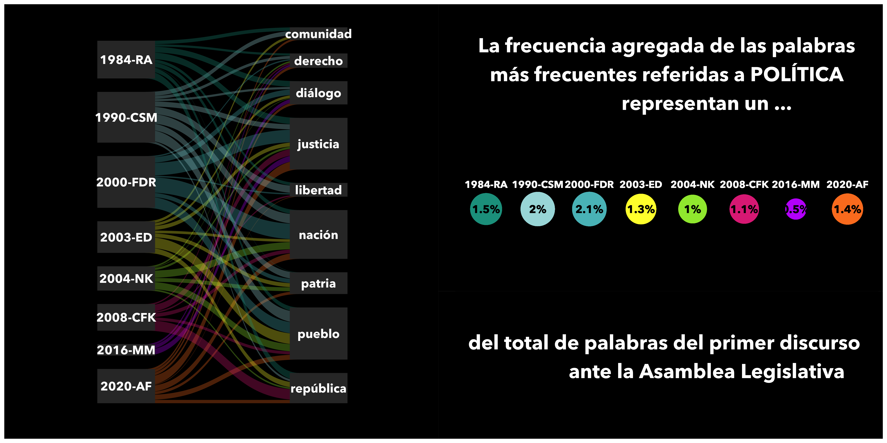

```{r submission-checks, echo=FALSE, warning=TRUE}
# Runs some basic checks in metadata. To disable, set check_is_error to FALSE
latinr::latinr_checks(rmarkdown::metadata, params$check_is_error)
```


```{r setup, include=FALSE}
knitr::opts_chunk$set(echo = TRUE)
```


## Abstract 

El primero de marzo de cada año  las cámaras de Diputados y Senadores de la Nación Argentina se reúnen en asamblea para dar comienzo al año legislativo. Cada año el presidente de turno encabeza  dicho acto con un discurso[^1]. Estos suelen girar en torno a los ejes de gobierno o promesas y objetivos del año. Es notorio que estos mensajes tiene un estilo y contenido marcado por quien ejerce el gobierno. En este trabajo partimos de una gran cantidad de texto contenido en cada uno de los discursos presidenciales desde el retorno de la democracia en 1983 para poder encontrar tanto patrones comúnes como diferencias entre los primeros mandatarios y entre ellos mismos a lo largo del tiempo.

[^1]: La fuente original de todos los discursos puede consultarse en línea en [https://www.hcdn.gob.ar/secparl/dgral_info_parlamentaria/dip/documentos/mensajes_presidenciales.html](https://www.hcdn.gob.ar/secparl/dgral_info_parlamentaria/dip/documentos/mensajes_presidenciales.html)


Hacer uso de la *minería de texto* de los discursos de los presidentes como estrategia de investigación es de utilidad para un rápido y eficiente análisis exploratorio del gran volúmen de información contenida en los mismos. Dentro del ecosistema de `R` este campo ha ido creciendo sostenidamente. Liberias como \CRANpkg{tm} y \CRANpkg{topicmodels} son herramietnas poderosas para el procesamiento, manipulación y modelado de la información contenida en el texto. Siguiendo la filosofía de \CRANpkg{tidyverse}  Sigle y Robinson [-@Silge2016] desarrollaron \CRANpkg{tidytext}, que hace mucho más facil una primera introducción a esta técnica de investigación y su integración con otras como \CRANpkg{ggplot2} para la visualización. 

Un flujo de trabajo como el descripto más arriba puede ilustrarse siguiendo el esquema propuesto por Silge y Robinson [-@silge_text_2020]:

```{r diagrama, echo=FALSE, fig.align='center', out.width="80%"}
knitr::include_graphics("../../img/diagrama.png")
```

1. Descargamos los archivos con el texto de $37$ discursos emitidos por $8$ presidentes. Desde el primero de Alfonsín en la transición a la democracia (1984) hasta el último con el que Alberto Fernández dio inicio a las sesiones legislativas (2020). Entre todos suman alrededor de $365_{mil}$ palabras con un promedio de $9880$ y picos mínimo de $2846$ (Carlos Menem en 1996) y máximo de $26.189$ (Cristina Fernández de Kirchner en $2013$). 

2. Con esa información construimos una única base de datos siguiendo el principo *datos de texto ordenados* (*tidy text*) propuesto por Sigle y Robinson [-@Silge2016] como extensión de los *datos ordenados* (*tidy*) de Wickham [-@JSSv059i10]: 

 * Cada variable debe tener su propia columna.
 * Cada observación debe tener su propia fila.
 * Cada valor debe tener su propia celda.

Sigle y Robinson [-@Silge2016] definen entonces que los *datos de texto ordenados* cuando la tabla de datos está compuesta por "un *token* por fila". *Un token es una unidad de texto significativa, como una palabra* (o un *bigrama*)*, que estamos interesados en usar para el análisis, y la tokenización es el proceso de dividir el texto en tokens*[^2]. 

[^2]: Traducción propia de *The tidy text format* [@Silge2016].

3. Trabajamos con \CRANpkg{dplyr} para calcular frecuencias de palabras y \CRANpkg{tidytext} para calcular palabras de mayor importancia comparada entre discursos (*tf_idf*). Por último \CRANpkg{ggplot2} (y extensiones como \CRANpkg{patchwork} y \CRANpkg{ggforce}) para las visualizaciones. 

### Ejemplo: primeros discursos presidenciales

Inspirados en un trabajo del equipo de datos de la Universidad de Berkeley (California)[^3] calculamos la frecuencia con la que los presidentes utilizaron determinadas palabras relacionadas con un tópico específio, en este caso etiquetadas como *Política*.  

[^3]: *The Language of Data: Analyzing the State of the Union* [-@berkeley].

```{r parrallel_discursos, echo=FALSE, fig.align='center', out.width="100%"}

```


## Referencias


