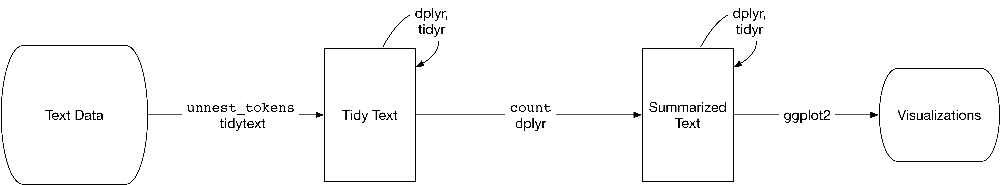

```{r submission-checks, echo=FALSE, warning=TRUE}
# Runs some basic checks in metadata. To disable, set check_is_error to FALSE
latinr::latinr_checks(rmarkdown::metadata, params$check_is_error)
```


```{r setup, include=FALSE}
knitr::opts_chunk$set(echo = TRUE)
```


## Abstract 

El primero de marzo de cada año las cámaras de Diputados y Senadores de la Nación Argentina se reúnen en asamblea para dar comienzo al año legislativo y el presidente de turno encabeza el acto con un discurso[^1]. Éstos suelen girar en torno a los ejes de gobierno o promesas y objetivos del año. Es notorio que estos mensajes tiene un estilo y contenido marcado por quien ejerce el gobierno. En este trabajo analizamos el texto contenido en los discursos presidenciales desde el primero en 1854 por Justo José De Urquiza hasta el último en 2020 por Alberto Fernández.


[^1]: La fuente original de todos los discursos puede consultarse en línea en [https://www.hcdn.gob.ar/secparl/dgral_info_parlamentaria/dip/documentos/mensajes_presidenciales.html](https://www.hcdn.gob.ar/secparl/dgral_info_parlamentaria/dip/documentos/mensajes_presidenciales.html). Los mismos fueron posteriormente digitalizados mediante proceso de OCR y se encuentran disponibles para descargar desde `R` a través del paquete `{polAr}`[@polAr]. 


La *minería de texto* como estrategia de investigación es de utilidad para un rápido y eficiente análisis exploratorio del gran volúmen de información contenida en los discursos presidenciales. Dentro del ecosistema de `R` este campo ha ido creciendo sostenidamente. Liberías como \CRANpkg{tm} y \CRANpkg{topicmodels} son herramientas poderosas para el procesamiento, manipulación y modelado de la información contenida en el texto. Siguiendo la filosofía de \CRANpkg{tidyverse},  Silge y Robinson [-@Silge2016] desarrollaron \CRANpkg{tidytext} que facilita una primera introducción a esta técnica de investigación y su integración con otras como \CRANpkg{ggplot2} para la visualización. 

Un flujo de trabajo como el descripto anteriormente puede ilustrarse siguiendo el esquema propuesto por Silge y Robinson [-@silge_text_2020]:

```{r diagrama, echo=FALSE, fig.align='center', out.width="80%"}

```

1. Se encuentran digitalizados los $114$ discursos emitidos por los $31$ presidentes que dieron lugar a la apertura de las sesiones legislativas. Debe mencionarse que no hay un discurso por año debido, principalmente, a las interrupciones institucionales cuando el congreso no sesionó. Entre todos suman alrededor de $1.358.792$ palabras con un promedio de $11.919$ y picos mínimo de $258$ (Hipolito Yrigoyen $1917$) y máximo de $44.415$ (Ramon Castillo en $1942$). 

2. Con esa información construimos una única base de datos siguiendo el principo *datos de texto ordenados* (*tidy text*) propuesto por Silge y Robinson [-@Silge2016] como extensión de los *datos ordenados* (*tidy*) de Wickham [-@JSSv059i10]: 

 * Cada variable debe tener su propia columna.
 * Cada observación debe tener su propia fila.
 * Cada valor debe tener su propia celda.

Silge y Robinson [-@Silge2016] definen entonces a los *datos de texto ordenados* cuando están en una tabla compuesta por "un *token* por fila". *Un token es una unidad de texto significativa, como una palabra* (o un *bigrama*)*, que estamos interesados en usar para el análisis, y la tokenización es el proceso de dividir el texto en tokens*[^2]. 

[^2]: Traducción propia de *The tidy text format* [@Silge2016].

3. Trabajamos con \CRANpkg{dplyr} para calcular frecuencias de palabras, \CRANpkg{tidytext} para identificar las más relevantes comparadas entre discursos (*tf-idf*) y \CRANpkg{ggplot2} para las visualizaciones. 

### Ejemplo: Trayectoria en el discurso

Mediante las técnicas _TF-IDF_ y _Principal Component Analysis (PCA)_ es posible embeber numéricamente los discursos considerando el uso de palabras en cada uno ponderados por su longitud y así visualizar los presidentes de mayor y menor variabilidad discursiva en comparación con los promedios de los demás.

```{r echo=FALSE, fig.align='center', out.width="100%",out.height='27%'}

```

Las limitaciones de técnicas basadas en la frecuencia de palabras independientemente del orden (como son _Bag of Words_ y _TF-IDF_) están vinculadas con el vocabulario por un lado, y con la semántica por el otro. Así, para trabajar mejor con textos históricos (el más antiguo en este caso tiene 166 años) es recomendable usar técnicas que hagan uso del contexto como puede ser _Doc2Vec_.

## Referencias
