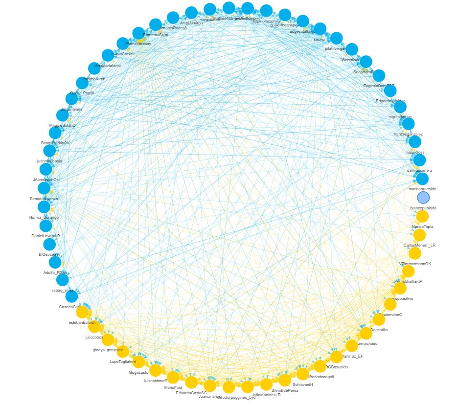

```{r submission-checks, echo=FALSE, warning=TRUE}
# Runs some basic checks in metadata. To disable, set check_is_error to FALSE
latinr::latinr_checks(rmarkdown::metadata, params$check_is_error)
```


```{r setup, include=FALSE}
knitr::opts_chunk$set(echo = TRUE)
```


## Abstract 

*Twitter* es la plataforma preferida para el análisis de datos políticos en redes. Hay por lo menos dos razones que lo explican: *(a)* es allí donde la mayoría de los dirigentes políticos se expresan (y, por ende, donde el público que consume información política interactúa); y *(b)* es la red que disponibiliza libremente grandes volúmenes de información. 

En la actualidad podemos encontrar varias librerías de distintos lenguajes que facilitan la recopilación de estos datos. Para fines de investigación encontramos dos que pueden ser ejecutadas desde *R* que se destacan sobre el resto. Una primera opción es trabajar con `twint`[^1] (programa escrito en *python* que puede correr en *R* a través de \CRANpkg{reticulate}). Una segunda alternativa, plenamente integrada con la API de la plataforma de *microblogging* es \CRANpkg{rtweet} [@rtweet-package].  

Partiendo de esto desarrollamos una aplicación \CRANpkg{shiny} que nos permite analizar de manera agregada a través de determinados indicadores y visualizaciones las cuentas de las personas que integran el ecosistema político e institucional de Argentina: monitorear la actividad de las cuentas, cómo interactúa el público con la información que publican y las relaciones entre legisladores/as nacionales, gobernadores/as provinciales y miembros del gabinete nacional en Twitter[^4]. La herramienta se divide en tres secciones: \vspace{.3cm}

1. **Métricas**: permiten explorar la conversación desde el lado de la oferta para evaluar qué y cómo publican contenido las cuentas seleccionadas. Al seleccionar `categoría` $+$ `nombre` se obtienen métricas individuales de cada uno: mejores publicaciones (considerando frecuencia de *likes* y *RT* de cada publicación) y ranking de usuarios mencionados y hashtags utilizados[^2].

2. **Ratio**: cuantifica la relación entre las distintas reacciones posibles ante un tuit (*RT*, *Me Gusta*, *Fav*) partiendo de la hipótesis que a mayor cantidad de respuestas en relación a las otras interacciones, el mensaje tuvo peor recepción en el público[^3]. El foco de esta información está puesto en cómo interactúa el público con las publicaciones. Cada punto representa a una cuenta. Los distintos *ponderadores*  muestran los puntos en función del nivel de actividad (*cantidad de publicaciones*) y de rendimiento (*promedio de interacciones*). Se puede además `filtrar` la información y represntar diferencias por género y espacios políticos (*oficialismo* y *oposición*) según el color. *Publicaciones en el tiempo* muestra los *tuits* por día de emisión con su respectivo ratio. Adicionalmente se puede filtrar por palabras clave, por espacio y por fecha de la muestra. Finalmente, al *clickear* los puntos se accede a la publicación original.

3. **Usuarios en Red**: Ernesto Calvo y Andrés Malamud -@calvo_cafecito_2014 sostienen que *"los motivos para “seguir” o “ser seguido” por un político son variados, y van desde la afinidad partidaria, cultural o territorial hasta el espionaje, pasando por el consumo irónico. Sin embargo, la intuición sugiere que la afinidad prevalece y la evidencia lo confirma: los políticos siguen a más “amigos” que a rivales. Como la decisión de a quién seguir es pública, con ella envían señales de pertenencia y de reciprocidad tanto a los votantes como a sus potenciales aliados"*.

Partiendo de la idea precedente identificamos la totalidad de las cuentas *seguidas* por nuestros usuarios para luego poder agruparlos según *"afinidad"*. Luego, para cada una de las categorías políticas (*vg.* `Gabinete Nacional` o `Gobernadores`) reconstruímos las conexiones entre sus miembros mediante grafos. 

* Al seleccionar un usuario se visualiza la red que refleja la relación seguidos/seguidores entre miembros de una misma categoría (al 9 de diciembre de 2019, día previo al inicio de una nueva gestión de gobierno en Argentina).


* Cada *nodo* (círculo) corresponde a la cuenta de un usuario/a y las *aristas* (flechas) marcan la dirección de quién sigue a quién.


* Los colores de los *nodos* son asignados luego de haber agrupado las cuentas con un método de *clusterización random walk* en base a cómo correlacionaban entre sí en función de las listas de *seguidos*. Los colores de las *aristas* heredan el color de los *seguidores* en su vínculo con los *seguidos*. Cuando un par de cuentas se sigue recíprocamente el color refleja una combinación de los dos.


```{r red, echo=FALSE, fig.align='center', out.width="50%"}

```


[^1]: *Twint* es un proyecto de *Python* que va más allá de los límites establecidos por la API de Twitter [https://github.com/twintproject](https://github.com/twintproject)


[^2]: Esta sección está basada en el desarrollo de Garrik Aden-Buie [https://github.com/gadenbuie/tweets-of-2019](https://github.com/gadenbuie/tweets-of-2019)

[^3]: Este apartado está inspirado en el trabajo de Roeder y otros [-@oliver_roeder_worst_2017] sobre el comportamiento de los usuarios con las publicaciones de políticos de EE.UU. en *FiveThirtyEight* y el posterior análisis sobre el caso argentino de Galup y Pilorget [-@pilorget_grieta_2018]. 

[^4]: `Shiny app` en línea: [http://tuitometro.mentacomunicacion.com.ar/](http://tuitometro.mentacomunicacion.com.ar/)

## Referencias
